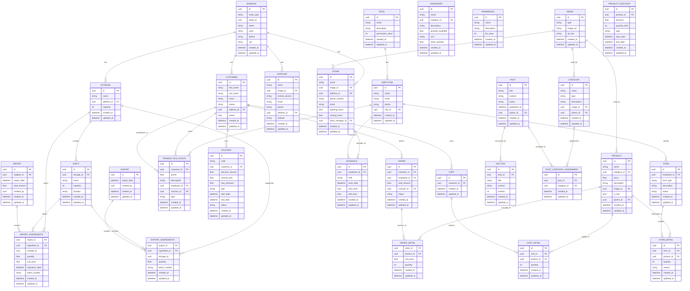

# ERD

```mermaid
erDiagram


%% Address
ADDRESS {
    uuid id PK
    string entity_type
    uuid entity_id
    string street
    string ward
    string district
    string city
    datetime created_at
    datetime updated_at
}

%% Store
STORE {
    uuid id PK
    string name
    uuid image_id FK
    uuid address_id FK
    string phone_number
    string email
    time opening_hours
    time closing_hours
    uuid store_manager_id FK
    datetime created_at
    datetime updated_at
}

%% Storage
STORAGE {
    uuid id PK
    string name
    uuid address_id FK
    int capacity
    datetime created_at
    datetime updated_at
}

%% Shelf
SHELF {
    uuid id PK
    uuid storage_id FK
    string name
    int capacity
    string location
    datetime created_at
    datetime updated_at
}

%% Image
IMAGE {
    uuid id PK
    string type
    string image_url
    string alt_text
    datetime created_at
    datetime updated_at
}

%% Supplier
SUPPLIER {
    uuid id PK
    string name
    uuid image_id FK
    string contact_person
    string email
    string phone
    uuid address_id FK
    string website
    datetime created_at
    datetime updated_at
}

%% Category
CATEGORY {
    uuid id PK
    string name
    string type
    string description
    uuid image_id FK
    uuid parent_id FK
    datetime created_at
    datetime updated_at
}

%% Product
PRODUCT {
    uuid id PK
    string name
    uuid category_id FK
    float price
    string description
    uuid image_id FK
    bool is_box
    uuid parent_id FK
    datetime created_at
    datetime updated_at
}

%% Ingredient
INGREDIENT {
    uuid id PK
    string name
    uuid category_id FK
    string description
    float quantity_available
    string unit
    float stock_quantity
    datetime created_at
    datetime updated_at
}

%% Import
IMPORT {
    uuid id PK
    uuid supplier_id FK
    datetime import_date
    float total_amount
    uuid created_by
    datetime created_at
    datetime updated_at
}

%% Import_Ingredients
IMPORT_INGREDIENTS {
    uuid import_id FK
    uuid ingredient_id FK
    uuid storage_id
    float quantity
    float unit_price
    datetime expiration_date
    string batch_number
    datetime created_at
    datetime updated_at
}

%% Export
EXPORT {
    uuid id PK
    datetime export_date
    uuid created_by
    datetime created_at
    datetime updated_at
}

%% Export_Ingredients
EXPORT_INGREDIENTS {
    uuid export_id FK
    uuid ingredient_id FK
    uuid storage_id
    float quantity
    string batch_number
    datetime created_at
    datetime updated_at
}

%% Customer
CUSTOMER {
    uuid id PK
    string first_name
    string last_name
    string email
    string phone
    uuid address_id FK
    float points
    datetime created_at
    datetime updated_at
}

%% Permission
PERMISSION {
    uuid id PK
    string name
    string description
    int bit_value
    datetime created_at
    datetime updated_at
}

%% Role
ROLE {
    uuid id PK
    string name
    string description
    int permission_value
    datetime created_at
    datetime updated_at
}

%% Employee
EMPLOYEE {
    uuid id PK
    string name
    string email
    string phone
    uuid role_id FK
    datetime created_at
    datetime updated_at
}

%% Transaction_Points
TRANSACTION_POINTS {
    uuid id PK
    uuid customer_id FK
    float points
    string description
    uuid employee_id FK
    uuid voucher_id FK
    string type
    datetime created_at
    datetime updated_at
}

%% Product_Discount
PRODUCT_DISCOUNT {
    uuid id PK
    uuid product_id FK
    float discount
    int quantity_limit
    string type
    datetime start_date
    datetime end_date
    datetime created_at
    datetime updated_at
}

%% Voucher
VOUCHER {
    uuid id PK
    string code
    uuid customer_id FK
    float discount_amount
    float amount_limit
    float max_discount
    string type
    datetime start_date
    datetime end_date
    string status
    datetime created_at
    datetime updated_at
}

%% Order
ORDER {
    uuid id PK
    uuid customer_id FK
    uuid employee_id FK
    float total_amount
    uuid voucher_id FK
    string status
    datetime created_at
    datetime updated_at
}

%% Order_Detail
ORDER_DETAIL {
    uuid order_id FK
    uuid product_id FK
    float unit_price
    int quantity
    datetime created_at
    datetime updated_at
}

%% Schedule
SCHEDULE {
    uuid id PK
    uuid employee_id FK
    string shift
    datetime work_date
    time start_time
    time end_time
    datetime created_at
    datetime updated_at
}

%% Cart
CART {
    uuid id PK
    uuid customer_id FK
    datetime created_at
    datetime updated_at
}

%% Cart_Detail
CART_DETAIL {
    uuid id PK
    uuid cart_id FK
    uuid product_id FK
    int quantity
    datetime created_at
    datetime updated_at
}

%% Form
FORM {
    uuid id PK
    uuid employee_id FK
    string form_type
    string description
    string status
    datetime created_at
    datetime updated_at
}

%% Form_Detail
FORM_DETAIL {
    uuid id PK
    uuid form_id FK
    uuid product_id FK
    int quantity
    string reason
    datetime created_at
    datetime updated_at
}

%% Post
POST {
    uuid id PK
    string title
    string content
    string status
    datetime published_at
    uuid author_id FK
    datetime created_at
    datetime updated_at
}

%% Section
SECTION {
    uuid id PK
    uuid post_id FK
    string title
    string content
    int position
    datetime created_at
    datetime updated_at
}

%% Post_Category_Assignment
POST_CATEGORY_ASSIGNMENT {
    uuid id PK
    uuid post_id FK
    uuid category_id FK
    datetime created_at
    datetime updated_at
}

%% Relationships
ADDRESS ||--o{ STORE : has
ADDRESS ||--o{ STORAGE : has
ADDRESS ||--o{ SUPPLIER : has
ADDRESS ||--o{ CUSTOMER : has
IMAGE ||--o{ STORE : used_by
IMAGE ||--o{ PRODUCT : used_by
IMAGE ||--o{ CATEGORY : used_by
ROLE ||--o{ EMPLOYEE : has
EMPLOYEE ||--o{ FORM : creates
EMPLOYEE ||--o{ TRANSACTION_POINTS : manages
CUSTOMER ||--o{ TRANSACTION_POINTS : earns
CUSTOMER ||--o{ VOUCHER : uses
STORE ||--o{ SCHEDULE : operates_at
STORAGE ||--o{ SHELF : contains
STORAGE ||--o{ IMPORT_INGREDIENTS : stores
STORAGE ||--o{ EXPORT_INGREDIENTS : dispatches
SHELF ||--o{ IMPORT_INGREDIENTS : stocks
SHELF ||--o{ EXPORT_INGREDIENTS : provides
PRODUCT ||--o{ ORDER_DETAIL : included_in
PRODUCT ||--o{ CART_DETAIL : added_to
PRODUCT ||--o{ FORM_DETAIL : requested_in
IMPORT ||--o{ IMPORT_INGREDIENTS : contains
EXPORT ||--o{ EXPORT_INGREDIENTS : includes
ORDER ||--o{ ORDER_DETAIL : consists_of
CART ||--o{ CART_DETAIL : contains
FORM ||--o{ FORM_DETAIL : includes
CATEGORY ||--o{ POST_CATEGORY_ASSIGNMENT : categorized
POST ||--o{ POST_CATEGORY_ASSIGNMENT : assigned_to
POST ||--o{ SECTION : structured_by
EMPLOYEE ||--o{ SCHEDULE : works_in
CUSTOMER ||--o{ CART : owns
CUSTOMER ||--o{ ORDER : places
CUSTOMER ||--o{ TRANSACTION_POINTS : participates_in

```
